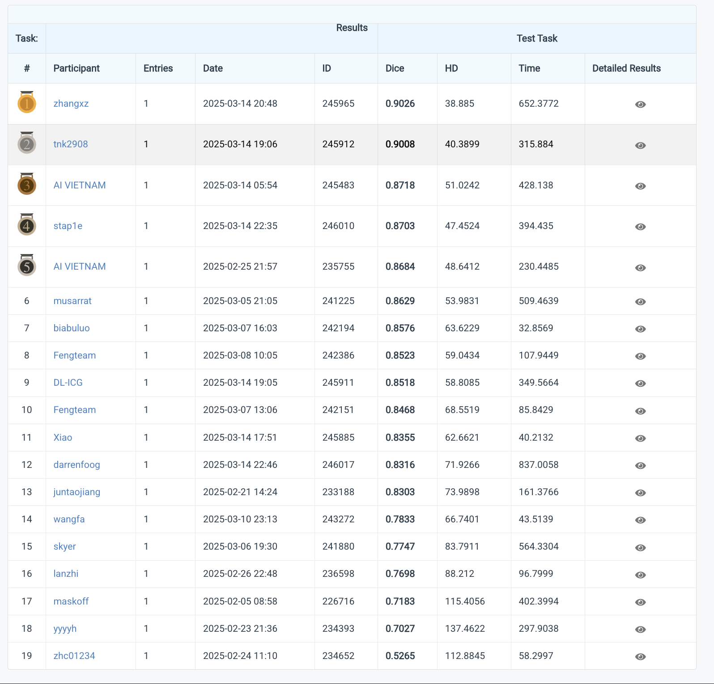

# Medical Image Analysis

## How to run

To run the active learning trainining, follow the following steps:

1. Install this repo:

```bash
pip install git+https://github.com/trnKhanh/medical-image-analysis
```

2. Download the dataset:
- FUGC 2025: [\[Raw\]](https://drive.google.com/file/d/1VMsbOKzJaSKekAKdtH4eHZA-KGL_HAbM/view?usp=sharing) [\[Processed\]](https://drive.google.com/file/d/1OK1EQgNQG2BSDzAH4wQ4zq3Z3IIiP819/view?usp=sharing)
- BUSI: [\[Processed\]](https://drive.google.com/file/d/1JEXKTKV9XHvunD4E3fAHmUXYQH2IHd1q/view?usp=sharing)
3. Run commands to train:
```bash
al_train --dataset {fugc,busi} --data-path <path/to/data>
```

## Results in FUGC 2025
Our team ranks 2nd on the public leaderboard (see [codabench](https://www.codabench.org/competitions/4781/#/results-tab)).

On the final leaderboard, our team ranks 1st.

