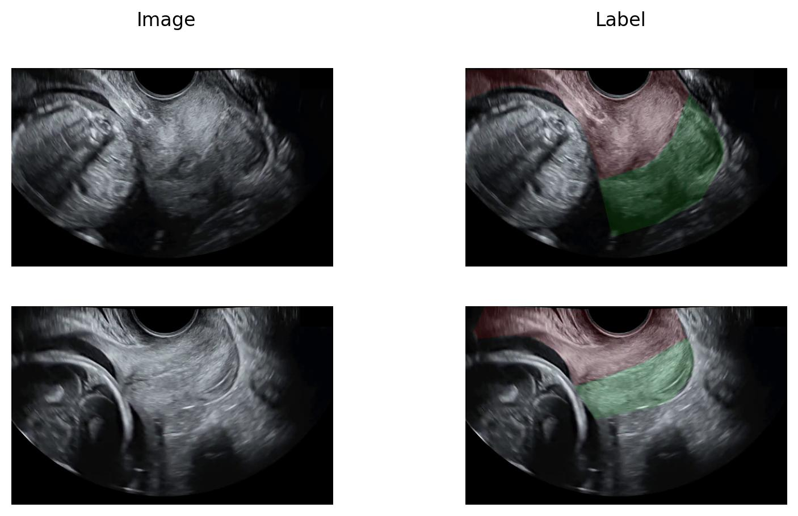
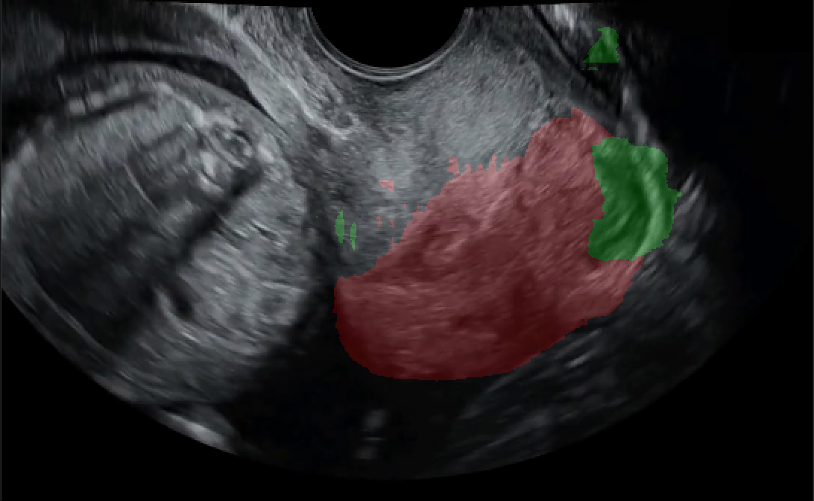
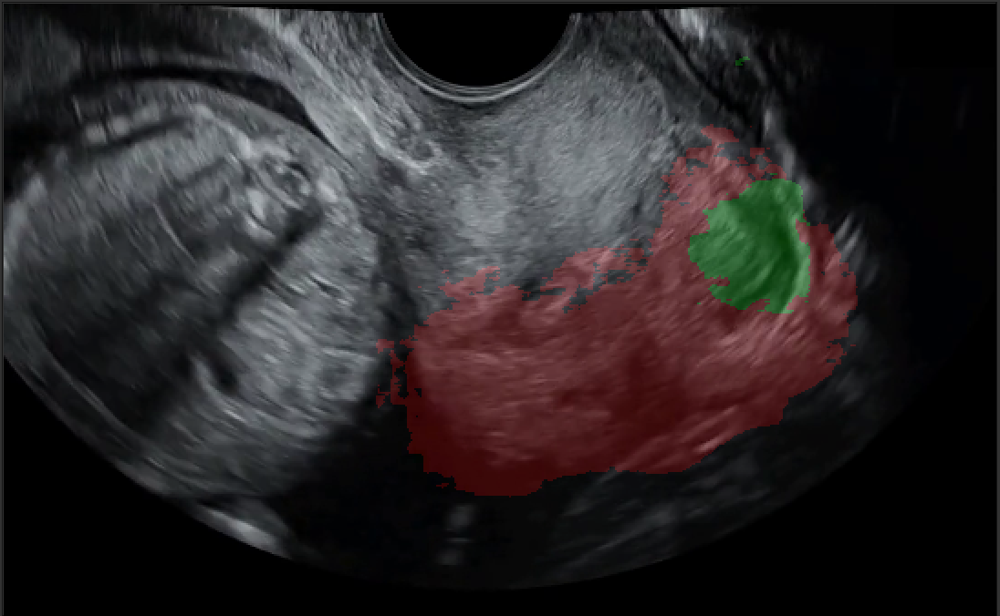
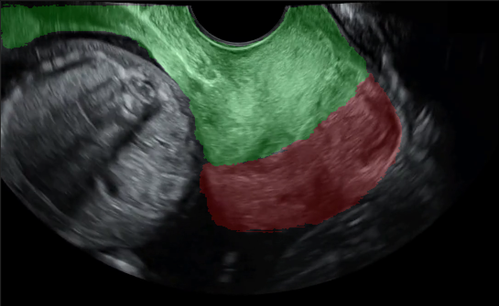
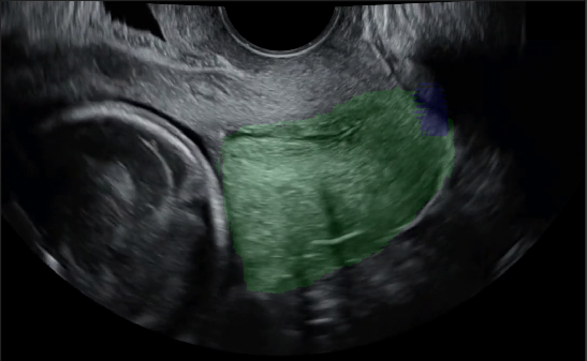
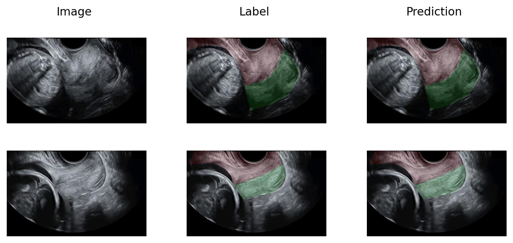
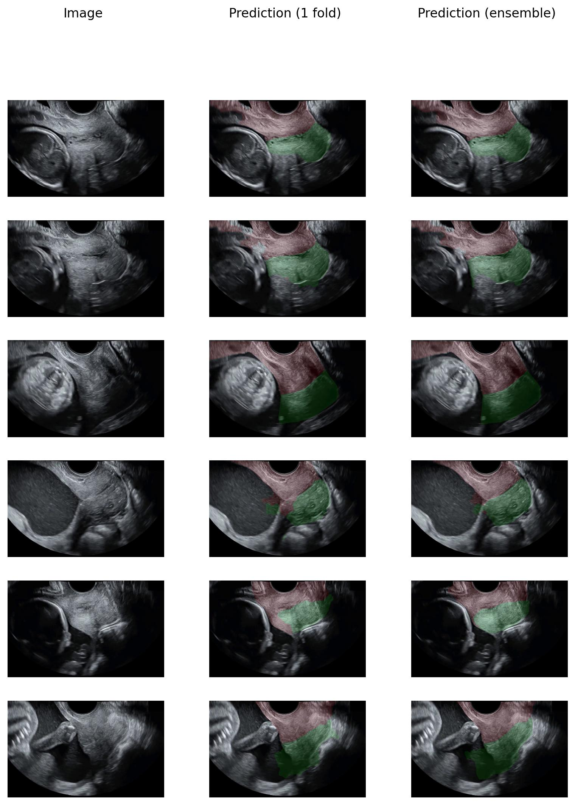

# Summary
- Start: 30 Dec 2024
- End: 5 Jan 2025
- Summary: This week, we need to investigate the dataset and the task of FUGC 2025. We have downloaded the dataset and run several quick experiments to test some of current SOTA methods.

# Objectives
- [x] Download FUGC 2025 dataset
- [ ] Run experiments:
	- [x] MedSAM
	- [ ] SAMUS
	- [x] nnUNet
	- [x] CONCH
- [ ] Invesetigate task: semi-supervised segmentation
	- [ ] Ultrasound segmentation
		- [ ] SOTA methods
		- [ ] Datasets
		- [ ] Codes
	- [ ] Semi-supervised methods
		- [ ] SOTA methods

# Recap

## FUGC 2025

### Description
- FUGC 2025 is a challenge about ultrasound image semi-supervised segmentation
- Main object: cervix part of women.
- Number of samples: 50 labeled images and 450 unlabled images.
- Number of classes: 3 
	- background
	- posterior lip
	- anterior lip.
- Size: $<100$ MB.

### FUGC samples

### Comments
- From our observation, the dataset has a very high inter-sample variance in the object size, colour, appearence. However, there is consistency in the position of objects (which makes sense), which could be the main feature to classify the objects.
- The boundary between the two main classes (posterior and anterior lips) is very vague, while the boundary between them and other (background) is quite apparent.

## Experiments

### CONCH
- We have tried to run the code on CRC-100K dataset. But we choose to hold on this methods for now because of 2 reasons:
	- CONCH focuses on histopathology images, which is different from the main modality the FUGC 2025.
	- The way that CONCH segments an image is similar to classify each patches and then interpolates it to higher resolutions, which is not applicable in the case of ultra-sound segmentation because we need to capture the fine boundary.

### MedSAM
- To use MedSAM, we must prompt it with the bounding box of the objects, which is not possible in the FUGC 2025.
- Therefore, we only focus on testing whether MedSAM is good enough out-of-the-box to segment a samples. In fact, it performs quite bad on the given samples.
- As a result, we try finetuning the model in two different ways:

#### No finetuning

#### Whole model finetuning
- We observe the decrease in performance. It could be because the data is too little to finetune the whole model (which has arround 100 milions parameters).

#### Decoder only finetuning
- There is decent increase in train set performance, but it still remains relatively poor for the unlabeled data.

### nnUNet

#### Train prediction
- We could see that nnUNet could fit to the training data quite well.

#### Test prediction
- For test (unlabeled data), we could see that nnUNet could capture the meaning of the samples to some extents. In most samples, the coarse masks are decent, but the boundary and details are quite bad. 
- In some samples, the masks are not continuous. The boundary of the objects is wrong. However, more inspection is needed as we are not even sure whether the masks are correct or not.
- In unlabeled data, we could see that the inter-sample invariance is even higher.
- In most cases, ensembling multiple models (from multiple folds) achieve better qualitative results.

# Conclusion
- We have investigated the FUGC 2025 dataset and observe several challenges of it:
	- High inter-sample variance.
	- Blur boundary between objects.
	- Small size dataset.
- For SOTA methods, there are several insights:
	- SAM-like methods might not good enough in this case because of two possible reasons:
		- Small size dataset: this makes it hard to finetune the SAM-like models since they normally have a very large network architecture.
		- Rare modalities: compared to other modalities like CT and MRI, ultrasound is rarer and harder since it is relatively noisy.
	- UNet properly works best in this situation because they can adapt relatively well to small dataset.
- There are several things that we need to further study:
	- SAMUS: SAM for ultrasound images. 
	- Transformer UNet vs CNN Unet: which is better?
	- Semi-supervised methods: what is some current methods:
		- We know that SAM and DINO pipeline is semi-supervised, what could we learn from them?
		- Are there SOTA pipelines for semi-supervised?

