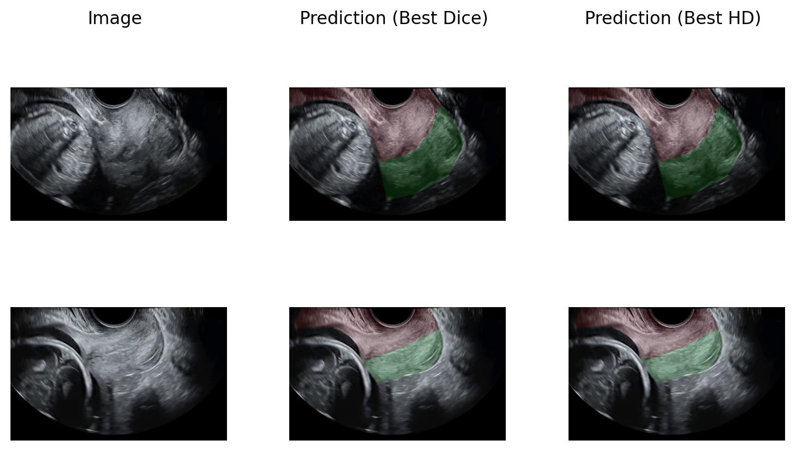
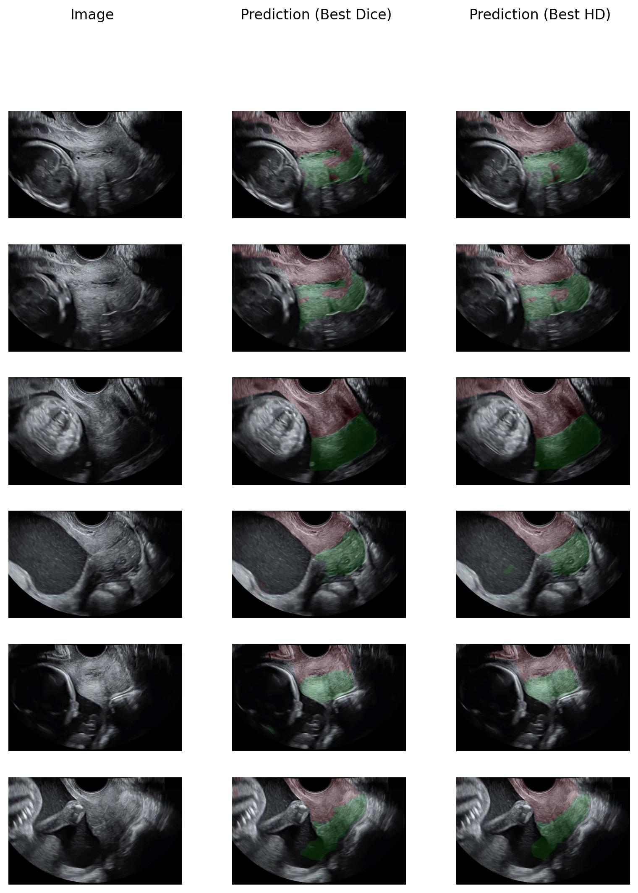

# Summary
- Start: 6 Jan 2024
- End: 19 Jan 2024
- Summary: In this period, we did some experiments about which augmentation could be used for the dataset provided by FUGC 2025.

# Objectives
- [x] Augmentation survey
- [ ] Validation methods:
	- [ ] Cross validation

# Results

## Train prediction

## Test prediction

# Recap
- The reported scores are from the validation of FUGC 2025.
- The highest scores are as follows:
	- Best dice:
		- dice: 0.820708  
		- hd: 55.585030  
	- Best HD:
		- dice: 0.813491  
		- hd: 44.526548
- The main augmentation:
	- Spatial:
		- Random rotation.
		- Random scale.
	- Pixel-level:
		- Gaussian noise.
		- Gaussian blur.
		- Random gamma.
		- Random brightness.
		- Random contrast.
		- Low resolution simulation.
- Base on the experiments that we did, the batch size heavily affects the results. We have tried to oversample the dataset (which do obtain the better results when spatial augmentation is used). However, increase the batch size from 4 to 16 results in worse prediction.
- In addition, use HD as a metric to save the best checkpoint help the prediction to have lower HD. We concluded that this is currently the best setup since it encourages the model to have better HD while the loss (SoftDice + CrossEntropy) improves the dice score.
# Plans
- Since we have reached the storage limit (15gb) on codabench. However the maximum number of attempts is 300, so we will email the organizers to deleted the old submission.
- Apply an semi-supervised approach, since until now, we only use supervised method. The simplest method is to predict mask for every unlabel samples and train in supervised manner for the new datasets.
- Try using a pre-trained models. Since we mostly investigated which augmentation methods are good and suitable for this dataset, we have not tried any pre-trained model yet.
